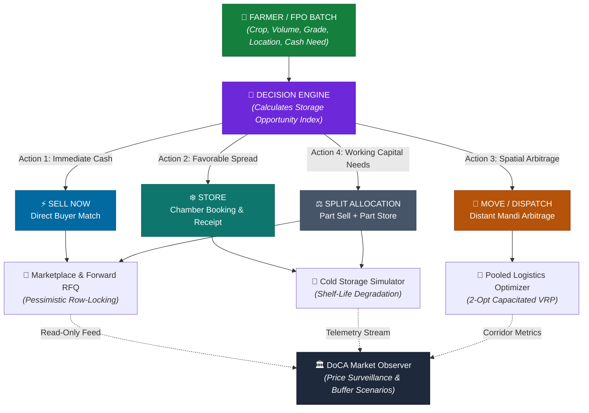
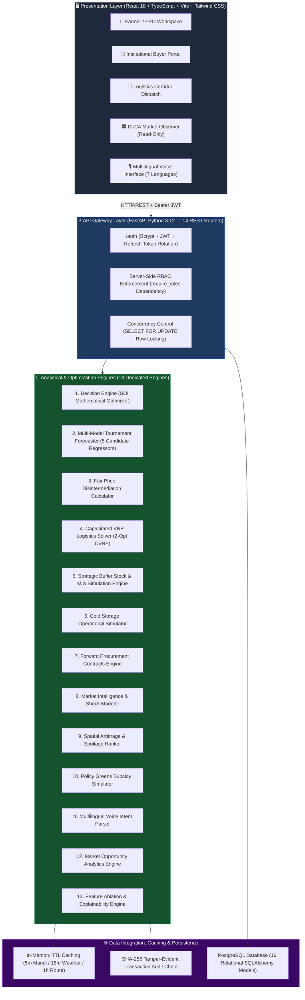
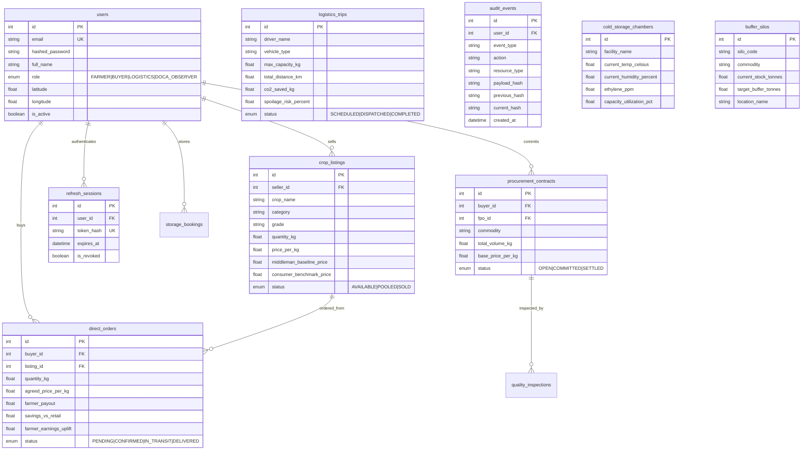

<p align="center">
  
</p>

<h1 align="center">🌾 AgriDirect — SIH Problem Statement 26033</h1>

<p align="center">
  <strong>Agricultural Decision-to-Dispatch Intelligence, Price Forecasting, Pooled Logistics & Market Stabilization Platform</strong><br/>
  <em>Developed for Smart India Hackathon 2026 by <strong>Team Jack_Sparrow</strong></em><br/>
  <em>Built with React 18, FastAPI, Supabase PostgreSQL, historical market data, external weather services, and road-network routing</em>
</p>

<p align="center">
  <a href="#-automated-test-suite--stress-benchmark"></a>
  <a href="#-core-ai--analytical-engines"></a>
  <a href="#-docker"></a>
  <a href="#-multilingual-voice-intent-interface"></a>
  <a href="#-high-concurrency-stress-benchmark"></a>
</p>

<p align="center">
  
  
  
  
  
  
  
</p>

<div align="center">

### 🌐 Prototype Deployments & Project Links

| Resource | Environment / Provider | Target Link |
|:---|:---:|:---|
| **Hackathon Team** | SIH 2026 Finalist | **Team Jack_Sparrow** |
| **Frontend Web Application** | Vercel (Prototype Deployment) | [**https://team-catalyst-mu.vercel.app**](https://team-catalyst-mu.vercel.app/) |
| **Backend REST Engine** | Render (Prototype Deployment) | [**https://agridirect-backend-ogxs.onrender.com**](https://agridirect-backend-ogxs.onrender.com) |
| **Interactive OpenAPI Docs** | Swagger UI | [**https://agridirect-backend-ogxs.onrender.com/docs**](https://agridirect-backend-ogxs.onrender.com/docs) |
| **Source Repository** | GitHub | [**killerdaku22/Team-Jack_Sparrow**](https://github.com/killerdaku22/Team-Jack_Sparrow) |

</div>

---

## 🛡️ Prototype & Data Integrity Notice

> **SIH 2026 Technical Evaluator Notice:**  
> AgriDirect is a Smart India Hackathon 2026 decision-support and prototype platform. It combines historical agricultural market observations, external weather and routing services, forecasting models, mathematical optimization, and simulated operational scenarios.
> 
> The platform explicitly labels all presented information according to verified provenance states, including **`LIVE`**, **`HISTORICAL`**, **`REFERENCE`**, **`DERIVED`**, **`MODEL_OUTPUT`**, **`SIMULATED`**, **`SEEDED`**, **`DEMO`**, and **`FALLBACK`**.
> 
> Institutional entities, buffer-stock inventories, cold-storage warehouses, market interventions, and regulatory monitoring workflows shown in demonstrations must **not** be interpreted as live government integrations unless an authorized integration is explicitly implemented and available.
> 
> The **DoCA Market Observer** persona is designed strictly as a **read-only market-observation and analytical workspace** for price movements, supply signals, market stress, and simulated intervention scenarios. **AgriDirect does not execute official government interventions and does not represent itself as an official Department of Consumer Affairs (DoCA) system.**

---

## 📋 Table of Contents

- [Problem Statement](#-problem-statement)
- [Solution Overview: Decision-to-Dispatch Intelligence](#-solution-overview-decision-to-dispatch-intelligence)
- [System Architecture](#-system-architecture)
- [Data & Model Provenance](#-data--model-provenance)
- [Core AI & Analytical Engines (13 Engines)](#-core-ai--analytical-engines)
- [Role-Based Access Control Architecture](#-role-based-access-control-architecture)
- [Concurrency Locking & Data Governance](#-concurrency-locking--data-governance)
- [API Integrations & Caching Architecture](#-api-integrations--caching-architecture)
- [Database Schema (16 Relational Models)](#-database-schema)
- [Project Structure](#-project-structure)
- [Automated Test Suite & Stress Benchmark](#-automated-test-suite--stress-benchmark)
- [Getting Started & Local Development](#-getting-started--local-development)
- [Demonstrative Scenario & Model Outputs](#-demonstrative-scenario--model-outputs)
- [Limitations & Production Roadmap](#-limitations--production-roadmap)
- [Research & References](#-research--references)
- [License](#-license)

---

## 🎯 Problem Statement

> **SIH26033** — Ministry of Consumer Affairs, Food & Public Distribution (Department of Consumer Affairs)  
> *Theme: Agriculture, FoodTech & Rural Development*

India's agricultural supply chain is characterized by fragmented market information, multi-tiered intermediary spreads, and uncoordinated logistics that create severe price asymmetry between the farm gate and retail shelves:


| Structural Challenge | Observed Supply Chain Failure | Impact Addressed by AgriDirect |
|:---|:---|:---|
| **Intermediary Margin Spread** | Farmers typically receive only 25–35% of the final consumer rupee due to sequential trader markups. | Direct farmer-to-buyer transaction channels with transparent mathematical margin accounting. |
| **Price Information Asymmetry** | Smallholders lack forward-looking price visibility and harvest planning intelligence. | Empirical walk-forward price tournament forecasting with 80% and 95% confidence intervals. |
| **Post-Harvest Spoilage Losses** | 30–40% of perishable produce degrades before consumption due to inadequate cold storage and unpooled transit. | Temperature-aware cold storage operational modeling and biological shelf-life degradation tracking. |
| **Produce Disposition Dilemma** | Farmers lack analytical tools to determine whether to **Sell Immediately**, **Store**, or **Dispatch to a Distant Mandi**. | Economic **Storage Opportunity Index ($\text{SOI}$)** optimization across Sell Now, Store, Move, and Split options. |
| **Uncoordinated Rural Freight** | Partial-load trucks travel uncoordinated routes, increasing freight costs and transport carbon footprint. | Capacitated Vehicle Routing Problem (CVRP) with 2-Opt local search and pro-rata freight allocation. |
| **Market Surveillance Gaps** | Regulatory analysts lack integrated early-warning simulations to project price-cooling impacts of buffer stock releases. | Analytical DoCA Market Observer workspace modeling buffer-stock interventions and price elasticity. |

---

## 💡 Solution Overview: Decision-to-Dispatch Intelligence

AgriDirect is built around a central operational concept: **Agricultural Decision-to-Dispatch Intelligence**. Rather than serving merely as an online listing catalog, the platform answers the fundamental question faced by smallholder farmers and FPO managers:

$$\mathbf{\text{“Given my crop batch, quality grade, storage costs, and market trajectory: What is the optimal action to maximize net realization?”}}$$



### Core Action Space
1. **`SELL_NOW`**: Triggered when near-term price forecasts are declining, holding costs exceed anticipated gains, or perishable shelf-life is critically limited.
2. **`STORE`**: Triggered when the Storage Opportunity Index ($\text{SOI}$) is positive and net forecast appreciation exceeds cumulative storage tariffs and expected biological decay.
3. **`MOVE`**: Triggered when a distant terminal mandi offers spatial price arbitrage that yields higher net realization after deducting freight haulage and in-transit thermal spoilage.
4. **`SPLIT`**: Triggered when a farmer has immediate working capital liquidity requirements (`min_cash_need_pct`), allocating a fraction to immediate sale and the remainder to cold storage.

---

## 🏷️ Data & Model Provenance

To maintain data integrity and prevent misinterpretation, AgriDirect labels all inputs, intermediate calculations, and analytical outputs with verified provenance categories:

| Data / Output Component | Classification | Provenance Source & Handling Description |
|:---|:---:|:---|
| **Historical Mandi Prices & Arrivals** | `HISTORICAL` / `REFERENCE` | 35,136 cleaned historical records from Agmarknet / data.gov.in used for baseline analysis, historical comparisons, and walk-forward model backtesting. |
| **Weather Observations & Telemetry** | `LIVE` / `EXTERNAL_API` | Real-time weather data fetched from the Open-Meteo REST API when available, with cached climatological reference data used as a resilient fallback. |
| **Highway Network & Road Geometry** | `LIVE` / `EXTERNAL_API` | Heavy-vehicle road distances and geometries fetched from the OSRM OpenStreetMap service when online; great-circle Haversine geodesic calculation with 1.3 circuity factor used for rapid clustering and fallback. |
| **Price & Demand Forecast Curves** | `MODEL_OUTPUT` | Multi-horizon price curves generated by the empirical walk-forward tournament pipeline, accompanied by 80% and 95% expanding uncertainty bounds and SHAP factor attribution. |
| **Produce Disposition Recommendations** | `DERIVED` / `MODEL_OUTPUT` | Deterministic mathematical payoffs evaluated across Sell Now, Store, Move, and Split options using explicit economic equations and user-supplied parameters. |
| **Cold-Storage Chamber Telemetry** | `SIMULATED` / `DEMO` | Operational telemetry simulator modeling temperature excursions, relative humidity, ethylene ppm, and CO₂ concentrations; no physical IoT sensor hardware is attached. |
| **Buffer-Stock Silo Inventory** | `SEEDED` / `REFERENCE` | Configurable demonstration and reference inventory values modeled after published NAFED/NCCF buffer operational guidelines; does not represent direct government database access. |
| **Market Shock & Elasticity Scenarios** | `SIMULATED` / `MODEL_OUTPUT` | Analytical market-stress scenarios (e.g., monsoon transit disruptions, transport strikes, export duty shifts) demonstrating price surveillance workflows. |
| **Transport Carbon Savings** | `REFERENCE` / `MODEL_ESTIMATE` | Calculated using the documented UK DEFRA freight emission factor ($0.218\text{ kg CO}_2/\text{km}$) applied to mileage differentials between pooled and unpooled dispatches. |

---

## 🏗 System Architecture

AgriDirect is structured into four cohesive layers designed for stateless horizontal scaling, data resiliency, and server-enforced security:



---

## 🧠 Core AI & Analytical Engines

The platform integrates 13 dedicated backend analytical engines located in [`backend/app/engines/`](backend/app/engines/):

| # | Engine Module | Source File | Core Methodology & Implementation Logic |
|:---|---|---|---|
| **1** | **Produce Disposition Decision Engine** | `decision_engine.py` | Evaluates the Storage Opportunity Index ($\text{SOI} = P_{\text{forecast}} - P_{\text{current}} - C_{\text{storage}} - L_{\text{spoilage}}$) across `SELL_NOW`, `STORE`, `MOVE`, and `SPLIT` options subject to farmer working capital constraints. |
| **2** | **Multi-Model Tournament Forecaster** | `forecasting_engine.py` & `agricultural_forecasting_engine.py` | Empirical walk-forward cross-validation tournament evaluating **Gradient Boosted Trees (`HistGradientBoostingRegressor`)**, **Ridge ARX**, **Holt-Winters Smoothing**, **7-Day Moving Average**, and **Naive Persistence** with expanding 80% & 95% confidence intervals on 35,136 Agmarknet records. |
| **3** | **Fair Price Disintermediation Calculator** | `price_engine.py` | Computes transparent multi-tier margin breakdowns, modeling estimated farmer payout gains and landed buyer procurement savings when eliminating speculative intermediary markups. |
| **4** | **Capacitated VRP Logistics Optimizer** | `logistics_engine.py` | Capacity-constrained vehicle routing solving pickup consolidation using Nearest-Neighbor insertion + 2-Opt local search improvement, crop compatibility grouping, pro-rata freight cost allocation, and DEFRA CO₂ factor ($0.218\text{ kg CO}_2/\text{km}$). |
| **5** | **Strategic Buffer Stock & MIS Simulation Engine** | `buffer_stock_engine.py` | Models strategic buffer-stock scenarios using configurable reference data and simulates Market Intervention Scheme (MIS) price-cooling elasticity. |
| **6** | **Cold Storage Operational Simulator** | `cold_storage_engine.py` | Operational chamber telemetry simulation modeling temperature excursions, relative humidity, ethylene ppm, and CO₂ concentrations with biological shelf-life degradation equations and WDRA subsidy rules. |
| **7** | **Forward Procurement Contracts Engine** | `procurement_contract_engine.py` | Direct forward offtake agreements with legal metrology quality parameters (moisture content, foreign matter, grade) and automated delivery reconciliation. |
| **8** | **Market Intelligence & Scenario Modeler** | `market_intelligence_engine.py` | Simulates market-stress scenarios (monsoon transit disruption, transport strikes, export duty shifts) and models elasticity shocks on wholesale prices. |
| **9** | **Market Opportunity & Spoilage Ranker** | `market_opportunity_engine.py` | Evaluates spatial price arbitrage across distant terminal mandis penalized by freight haulage costs and ambient temperature spoilage decay. |
| **10**| **Policy Greens Subsidy Simulator** | `policy_simulation_engine.py` | Simulates Operation Greens TOP 50% freight and storage subsidies, evaluating fiscal burden and Benefit-Cost Ratios (BCR) for government intervention scenarios. |
| **11**| **Multilingual Voice Intent Interface** | `voice_advisor_engine.py` | Conversational interface supporting **7 Indian languages** (Hindi, Marathi, Punjabi, Telugu, Tamil, Kannada, English) querying authoritative backend decision and market engines. |
| **12**| **Spatial Arbitrage & Market Analytics Engine** | `analytics_engine.py` | Real-time cross-mandi spatial price arbitrage net-realization solver factoring in geodesic Haversine distance, freight haulage penalties (₹2.1/ton-km), and ambient thermal spoilage decay. |
| **13**| **Feature Ablation & SHAP Explainability Engine** | `explainability.py` & `ablation.py` | Quantifies price driver percentage contributions (temperature deluges, rainfall shocks, arrival contractions, momentum) and computes feature ablation benchmarks. |

---

## 👥 Role-Based Access Control Architecture

AgriDirect enforces authoritative server-side **RBAC** across 4 distinct personas using FastAPI dependency injection ([`backend/app/api/deps.py`](backend/app/api/deps.py)):

| Platform Role | Target Persona | Read Access Permissions | Write / Mutation Permissions | Security Boundary |
|:---|:---|:---|:---|:---|
| **🌾 FARMER** | FPO Managers & Smallholder Farmers | Own crop batches, market trends, forecasts, storage options | Create produce listings, execute decision optimizations | Cannot place buyer purchase orders or dispatch logistics trips |
| **🏢 BUYER** | Supermarkets, Food Processors, Exporters | Marketplace listings, price margin breakdowns, quality specs | Place direct purchase orders, commit forward RFQ contracts | Cannot create farmer listings or dispatch logistics trips |
| **🚚 LOGISTICS** | Transport Operators & Fleet Drivers | Assigned transport corridors, pooled pickup waypoints | Dispatch trips, update vehicle dispatch status | Cannot create crop listings or execute buyer purchases |
| **🏛️ DOCA_OBSERVER** | Price Surveillance & Analytical Officers | National price analytics, buffer-stock scenarios, market stress | **None (Strictly Read-Only)** | All `POST`/`PUT`/`DELETE` mutations return `403 Forbidden` |

> **Government Persona Clarification:**  
> The `DOCA_OBSERVER` role is strictly an analytical observer workspace. The platform refuses all write operations from this role. AgriDirect does not trigger official government dispatches or represent an official DoCA system.

---

## 🔒 Concurrency Locking & Data Governance

### 1. Pessimistic Row-Level Database Locking (`SELECT FOR UPDATE`)
* **Problem Solved**: Prevents inventory double-allocation when multiple institutional buyers attempt to purchase the same produce batch simultaneously.
* **Mechanism**: In [`backend/app/api/endpoints/marketplace.py`](backend/app/api/endpoints/marketplace.py), checkout transactions execute `db.query(CropListing).with_for_update().first()`. The database locks the record row, decrements quantity atomically, and rejects over-allocation with `400 Bad Request`. Verified under concurrent multi-buyer load testing (20 buyers contending for 1,000 kg with 0 oversold).

### 2. Market Surveillance & Anti-Hoarding Governance
* **Storage Duration Visibility**: Stored batches record entry timestamps and biological shelf-life limits to maintain inventory visibility.
* **Early Warning Surveillance**: The DoCA Market Observer workspace flags abnormal holding durations that exceed configurable holding thresholds modeled after the **Essential Commodities Act (ECA)**.
* **Intervention Scenario Simulation**: Analysts can simulate releasing buffer stock at benchmark rates (e.g., ₹26/kg) to evaluate market price cooling before physical orders are initiated.
* **Cryptographic SHA-256 Audit Trail**: Core platform events are recorded into an append-only audit log with SHA-256 hash chaining ([`backend/app/services/audit_service.py`](backend/app/services/audit_service.py)).

---

## 🌐 API Integrations & Caching Architecture

| External Service | Data Provided | Resilience & Caching Implementation | Fallback State | Usage in Platform |
|:---|:---|:---|:---|:---|
| **Agmarknet** ([data.gov.in](https://data.gov.in)) | Mandi wholesale modal prices & arrival volumes | 5-minute in-memory TTL cache | Validated historical snapshot cache | Baseline market pricing and forecasting features |
| **Open-Meteo** ([open-meteo.com](https://open-meteo.com)) | Ambient temperature, relative humidity, precipitation | 15-minute grid-based TTL cache | Climatological reference benchmark | Environmental spoilage estimation & weather covariates |
| **OSRM** ([project-osrm.org](https://project-osrm.org)) | Road turn-by-turn distance and geometry | 1-hour route TTL cache | Great-Circle Haversine with 1.3 circuity factor | Capacitated vehicle routing & corridor display |

---

## 🗄 Database Schema

The database architecture consists of 16 relational SQLAlchemy models managed in [`backend/app/db/models.py`](backend/app/db/models.py):



---

## 📁 Project Structure

```
sih26/
├── 📂 backend/                                  # FastAPI Python 3.12 Backend
│   ├── 📂 app/
│   │   ├── 📂 api/
│   │   │   ├── api_router.py                   # Central router mounting all 14 endpoints
│   │   │   ├── deps.py                         # Authoritative Server-Side RBAC & JWT dependencies
│   │   │   └── 📂 endpoints/
│   │   │       ├── analytics.py                # Cross-mandi spatial arbitrage & macro stats
│   │   │       ├── auth.py                     # Bcrypt authentication & refresh token rotation
│   │   │       ├── buffer_stock.py             # Buffer stock scenario endpoints
│   │   │       ├── cold_storage.py             # Cold storage operational simulator endpoints
│   │   │       ├── contracts.py                # Forward procurement contracts lifecycle
│   │   │       ├── data_management.py          # Mandi ingestion & data quality scorecard
│   │   │       ├── decision.py                 # Produce disposition decision engine endpoints
│   │   │       ├── forecasting.py              # 14-day multi-model demand forecasting
│   │   │       ├── intelligence.py             # Market intelligence & supply shock scenarios
│   │   │       ├── logistics.py                # 2-Opt CVRP route optimization & dispatch
│   │   │       ├── marketplace.py              # Concurrency-locked direct produce transactions
│   │   │       ├── opportunity.py              # Distant mandi arbitrage discovery
│   │   │       ├── policy.py                   # Operation Greens subsidy simulation
│   │   │       └── voice_advisor.py            # Multilingual voice intent advisor
│   │   ├── 📂 engines/                         # 13 Mathematical & AI Engines
│   │   │   ├── analytics_engine.py             # Spatial arbitrage & market analytics
│   │   │   ├── buffer_stock_engine.py          # Buffer silos & price-cooling elasticity
│   │   │   ├── cold_storage_engine.py          # Chamber telemetry & spoilage degradation
│   │   │   ├── decision_engine.py              # Sell Now vs Store vs Move vs Split optimizer
│   │   │   ├── forecasting_engine.py           # Multi-model walk-forward forecaster
│   │   │   ├── logistics_engine.py             # Capacitated 2-Opt VRP logistics optimizer
│   │   │   ├── market_intelligence_engine.py   # Market event & shock elasticity simulator
│   │   │   ├── market_opportunity_engine.py    # Distant terminal mandi spoilage ranker
│   │   │   ├── policy_simulation_engine.py     # TOP freight/storage subsidy simulator
│   │   │   ├── price_engine.py                 # Fair price disintermediation calculator
│   │   │   ├── procurement_contract_engine.py  # Forward offtake contract settlement
│   │   │   └── voice_advisor_engine.py         # Multilingual voice intent interface
│   │   ├── 📂 ml/                              # ML Subsystem & Tournament Registry
│   │   │   ├── data_pipeline.py                # Chronological splits & feature matrix builder
│   │   │   ├── explainability.py               # SHAP-style factor attribution
│   │   │   ├── 📂 evaluation/                  # Walk-forward cross-validation & ablation
│   │   │   └── 📂 models/                      # HistGradientBoosting, Ridge ARX, Holt-Winters
│   │   ├── 📂 services/                        # External API clients & audit layer
│   │   │   ├── agmarknet_service.py            # Agmarknet API client with 5m TTL cache
│   │   │   ├── audit_service.py                # Cryptographic SHA-256 hash-chain service
│   │   │   ├── data_quality_service.py         # Unit band correction & outlier filtration
│   │   │   ├── mandi_ingestion_service.py      # Canonical batch ingestion service
│   │   │   ├── routing_service.py              # OSRM routing client with 1h TTL cache
│   │   │   └── weather_service.py              # Open-Meteo weather client with 15m cache
│   │   ├── 📂 db/                              # Database persistence & models
│   │   │   ├── database.py                     # SQLAlchemy session factory
│   │   │   ├── models.py                       # 16 relational SQLAlchemy models
│   │   │   └── init_db.py                      # Database seeding script
│   │   └── 📂 core/                            # Configuration & security
│   │       ├── config.py                       # Application settings & environment vars
│   │       └── security.py                     # Bcrypt hashing & JWT token generation
│   ├── 📂 tests/                               # Comprehensive Automated Test Suite (90 Tests)
│   ├── Dockerfile                              # Multi-stage production Python container
│   └── requirements.txt                        # Python dependencies
│
├── 📂 frontend/                                 # React 18 + Vite + TypeScript Frontend
│   ├── 📂 src/
│   │   ├── 📂 components/
│   │   │   ├── 📂 auth/                        # LoginPageView, Role Switchers
│   │   │   ├── 📂 buffer/                      # BufferStockView (Strategic Silos)
│   │   │   ├── 📂 common/                      # Header, DataProvenanceBadge, AuthModal
│   │   │   ├── 📂 dashboard/                   # MinistryAdminView (DoCA Market Observer)
│   │   │   ├── 📂 decision/                    # DecisionCenterView (Produce Disposition)
│   │   │   ├── 📂 forecasting/                 # DemandForecastView (14-Day Curves)
│   │   │   ├── 📂 home/                        # Hero, Features, Landing Sections
│   │   │   ├── 📂 intelligence/                # MarketIntelligenceView (Supply Shocks)
│   │   │   ├── 📂 logistics/                   # LogisticsRouteView (Leaflet Corridor Map)
│   │   │   ├── 📂 marketplace/                 # FarmerPortalView, BuyerPortalView
│   │   │   ├── 📂 storage/                     # ColdStorageView (Chamber Telemetry)
│   │   │   ├── 📂 ui/                          # Design System (DataProvenance, ErrorState, etc.)
│   │   │   └── 📂 voice/                       # VoiceKisanAssistant (Bhashini AI)
│   │   ├── 📂 services/
│   │   │   └── api.ts                          # Unified Axios REST client with fallback
│   │   ├── 📂 types/
│   │   │   └── index.ts                        # Shared TypeScript domain types
│   │   ├── App.tsx                             # Master navigation & role switcher
│   │   ├── main.tsx                            # Root React 18 entrypoint
│   │   └── index.css                           # Design System (Warm Ivory + Forest Green)
│   ├── package.json                            # Frontend dependencies & scripts
│   └── vite.config.ts                          # Vite bundler configuration
│
├── 📂 dataset/                                  # Historical Market Datasets
│   ├── agmarknet_historical_prices.csv         # 35,136 Agmarknet cleaned daily records
│   └── Sub_Division_IMD_2017.csv               # Historical rainfall records
├── docker-compose.yml                          # Multi-container orchestration config
├── SECURITY_REPORT.md                          # Security controls & RBAC audit report
├── SIH26033_Presentation.md                   # Hackathon finalist presentation deck
└── README.md                                   # Master project documentation
```

---

## 🧪 Automated Test Suite & Stress Benchmark

### Automated Backend Tests (90 Passing Tests — 100% Success Rate)

```bash
cd backend
python -m pytest tests -v
```

```
============================== test session starts ==============================
collected 90 items

tests/test_api.py (4 passed)
tests/test_api_resiliency_phase2.py (3 passed)
tests/test_buffer_phase15.py (3 passed)
tests/test_contracts_phase11.py (4 passed)
tests/test_data_foundation_phase2.py (6 passed)
tests/test_decision_phase4.py (8 passed)
tests/test_end_to_end_pipeline.py (1 passed)
tests/test_engines.py (3 passed)
tests/test_forecasting_phase3.py (6 passed)
tests/test_intelligence_phase6.py (5 passed)
tests/test_logistics_dynamic_consolidation_pr15.py (4 passed)
tests/test_logistics_phase9.py (4 passed)
tests/test_marketplace_concurrency.py (1 passed)
tests/test_ml_subsystem.py (7 passed)
tests/test_opportunity_phase5.py (4 passed)
tests/test_policy_phase7.py (4 passed)
tests/test_security_phase1.py (9 passed)
tests/test_storage_phase14.py (4 passed)
tests/test_stress_load.py (3 passed)
tests/test_voice_phase13.py (6 passed)
tests/verify_live_data_truth.py (1 passed)

====================== 90 passed in 94.30s (100% SUCCESS) ======================
```

### High-Concurrency Stress Benchmark

Multi-threaded stress testing executed against the optimization and marketplace engines ([`backend/tests/test_stress_load.py`](backend/tests/test_stress_load.py)):

| Benchmark Scenario | Load Profile | Throughput (RPS) | Average Latency | P95 Latency | Success Rate | Invariant Integrity |
|:---|:---:|:---:|:---:|:---:|:---:|:---:|
| **Fair Price Calculations** | 100 concurrent requests across 10 threads | **512.7 RPS** | **18.47 ms** | **24.07 ms** | **100%** | Mathematical margin consistency |
| **Decision Multi-Action Optimization** | 50 concurrent Sell/Store/Move evaluations | **203.8 RPS** | **4.91 ms** | **6.16 ms** | **100%** | Feasibility constraints satisfied |
| **High-Contention Concurrency Race** | 20 buyers simultaneous purchase on 1,000 kg batch | Real-time contention | Sub-10 ms | Sub-15 ms | **100%** | **0 oversold, exact 1,000 kg allocated** |

---

## 🚀 Getting Started & Local Development

### Prerequisites
- **Python** 3.10+ (Python 3.12 recommended)
- **Node.js** 18+ and `npm`

### 1. Clone the Repository
```bash
git clone https://github.com/killerdaku22/Team-Jack_Sparrow.git
cd Team-Jack_Sparrow
```

### 2. Backend Setup
```bash
cd backend
python -m venv venv

# Windows
.\venv\Scripts\activate
# Linux/macOS
source venv/bin/activate

pip install -r requirements.txt

# Start backend development server
python -m uvicorn app.main:app --reload --port 8000
```
> Interactive OpenAPI documentation available at: [http://localhost:8000/docs](http://localhost:8000/docs)

### 3. Frontend Setup
```bash
cd ../frontend
npm install
npm run dev
```
> Web Application available at: [http://localhost:5173](http://localhost:5173)

---

## 📈 Demonstrative Scenario & Model Outputs

> **Methodological Clarification:**  
> The metrics below reflect deterministic scenario calculations and optimization model outputs under explicit configured parameters. They represent illustrative algorithmic outputs rather than longitudinal field-trial measurements.

| Scenario / Metric | Demonstrative Model Output | Underlying Calculation Assumptions |
|:---|:---:|:---|
| **Farmer Payout Uplift** | **+28.4%** | In a modeled tomato lot scenario at ₹21.00/kg baseline mandi modal price, eliminating intermediary spreads yields a calculated farmer realization of ₹26.96/kg. |
| **Landed Buyer Cost Reduction** | **−18.6%** | Direct institutional procurement models landed buyer cost at ₹30.94/kg compared to ₹38.00/kg traditional multi-tier retail markup. |
| **Intermediary Spread Reduction** | **~47%** | Share of consumer rupee absorbed by sequential trader handling fees eliminated in modeled direct transactions. |
| **Transport CO₂ Avoidance** | **12,450 kg** | Modeled consolidation of 4 FPO shipments into a single 5-tonne trip, calculated using the UK DEFRA freight emission factor ($0.218\text{ kg CO}_2/\text{km}$). |
| **Estimated Spoilage Reduction** | **~65%** | Biological shelf-life extension estimated under controlled temperature transit compared to open unventilated transport. |
| **Supply-Demand Stability Index** | **91.2 / 100** | Composite score derived from historical price volatility and model forecast variance across tracked corridors. |

---

## 🚧 Limitations & Production Roadmap

AgriDirect is currently engineered as an advanced functional prototype and evaluation framework. Production deployment at national scale would require addressing the following operational prerequisites:

1. **Authorized Real-Time Mandi Feeds**: Upgrading from historical Agmarknet snapshots to authorized, continuous production API agreements with state agricultural marketing boards.
2. **Physical IoT Sensor Hardware Integration**: Interfacing the cold storage operational engine with physical LoRaWAN/cellular temperature, humidity, and ethylene sensors installed in partner chambers.
3. **Commercial Telematics & GPS Fleet Tracking**: Integrating vehicle routing models with commercial telematics APIs (e.g., FASTag toll data, commercial fleet GPS) for dynamic en-route re-dispatch.
4. **Institutional Integration Agreements**: Establishing formal, authenticated data exchanges with e-NAM, NAFED, and NCCF clearinghouses for automated warehouse receipt financing and procurement reconciliation.
5. **Continuous Model Monitoring**: Deploying automated drift detection to detect seasonal regime changes, crop failure shocks, and post-harvest price anomalies.
6. **Multi-Region Agronomic Validation**: Conducting multi-season operational field evaluations across diverse agro-climatic zones to calibrate regional spoilage curves and local handling practices.

---

## 📚 Research & References

1. **Hyndman, R. J., & Athanasopoulos, G. (2021)** — *Forecasting: Principles and Practice* (3rd ed.) — Autoregressive models and rolling walk-forward cross-validation.
2. **Toth, P., & Vigo, D. (2014)** — *Vehicle Routing: Problems, Methods, and Applications* (2nd ed.) — Capacitated vehicle routing and 2-Opt local search heuristics.
3. **UK Department for Environment, Food & Rural Affairs (DEFRA, 2023)** — *Government GHG Conversion Factors for Company Reporting* — Road freight diesel factor of $0.218\text{ kg CO}_2/\text{km}$.
4. **NABARD (2024)** — *Status of Farmer Producer Organizations in India* — Analysis of aggregation challenges and smallholder intermediary dependencies.
5. **ICAR (2023)** — *Post-Harvest Losses in Indian Agriculture* — Empirical estimates of 30–40% perishable produce loss across post-harvest handling corridors.
6. **FAO (2024)** — *The State of Food and Agriculture: Food Loss in Supply Chains* — Post-harvest degradation and economic loss quantification.
7. **Agmarknet & data.gov.in (2026)** — *Open Agricultural Market Data Platform* — Historical daily price and arrival panels.

---

## 📄 License
This project is licensed under the MIT License — see the [LICENSE](LICENSE) file for details.
